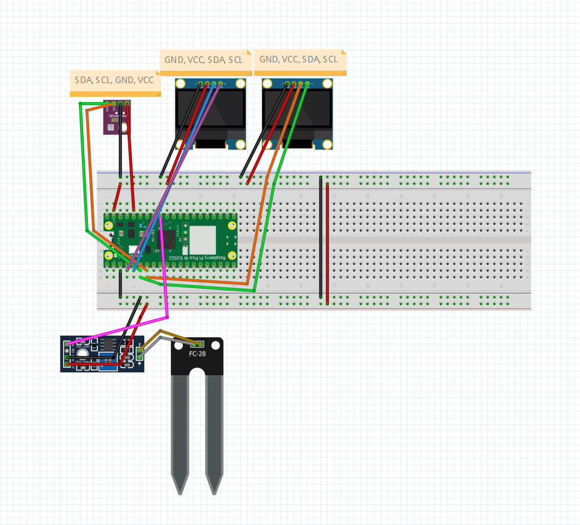

# IoT Plant Monitoring System

This repository contains code for an IoT plant monitoring system using MicroPython and various sensors. The system collects temperature, humidity, pressure, and moisture level data from sensors and displays it on OLED screens. Additionally, it sends this data to a server for further analysis or monitoring.

## Hardware Components Used

- Raspberry Pi Pico microcontroller
- BME280 sensor for temperature, humidity, and pressure
- Moisture sensor
- SSD1306 OLED displays (two displays used in this project)
- WiFi connection (if available, can be omitted if not needed)

## Setup Instructions

1. **Connect the hardware components**: Follow the wiring specified in the code.
2. **Flash MicroPython firmware**: Flash MicroPython firmware to your Raspberry Pi Pico microcontroller.
3. **Upload the Python scripts**: Upload the Python scripts (`main.py`) to the microcontroller.
4. **Modify the script**: If using WiFi, modify the script with your WiFi credentials (`WIFI_SSID` and `WIFI_PASSWORD`).
5. **Configure server endpoint**: Ensure that the server endpoint (`http://yourwebsite.com/route`) matches your server setup.
6. **Power on the device**: The device will automatically start collecting sensor data.

## Usage

Once the system is set up and running:

- **Display sensor data**: Sensor data (temperature, humidity, pressure, and moisture level) will be displayed on the OLED screens.
- **Moisture-based facial expression**: The moisture level will determine the facial expression displayed on one of the OLED screens (smiley or frowny face).
- **Data transmission**: Sensor data will be sent to the specified server endpoint via HTTP POST requests in JSON format.
- **Error handling**: The system will handle exceptions during sensor readings and continue operation.

## Notes

- **WiFi usage**: If you're not using WiFi, you can omit the WiFi connection part from the script.
- **Server endpoint**: Ensure that the server endpoint is accessible and configured to receive data in JSON format.
- **Adjustable sleep time**: Adjust the sleep time (`sleep(30)`) in the script to change the interval between sensor readings and data transmissions.

## Dependencies

- MicroPython firmware
- BME280 library
- ssd1306 library
- urequests library (for HTTP requests)

## Wiring Diagram

## License

This project is licensed under the MIT License - see the [LICENSE](LICENSE) file for details.

## Acknowledgments

- This project was inspired by the need for a simple and efficient plant monitoring system.
- Thanks to the contributors of the MicroPython, BME280, and ssd1306 libraries for their valuable work.
